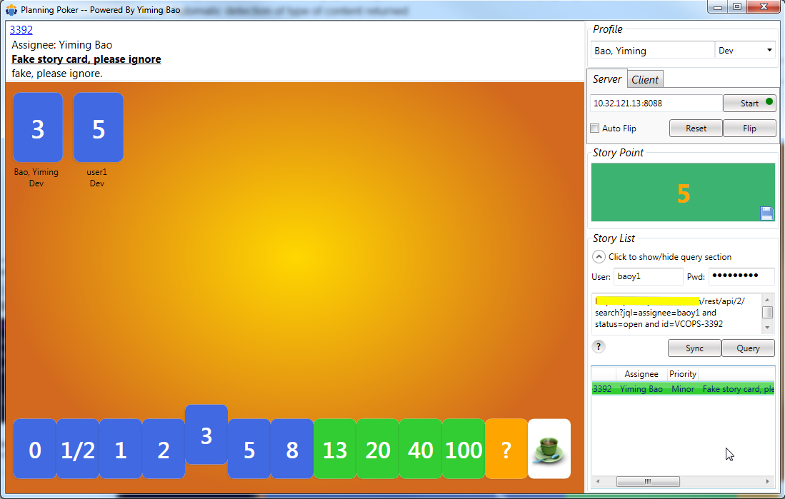

# Planning Poker.NET
This is a Windows desktop software, which is helpful to calculate story point. Please refer to [wikepedia](https://en.wikipedia.org/wiki/Planning_poker) for more information about planning poker.

### Prerequisite
.net framework 3.5 or above

### Features
* No need for registration.
  The user name is the unique identifier. By default, the software will intelligently use current user of Windows.
* Server and client share the same GUI. Anyone can be server or client.
* Story point calculation.
* User configuration can be saved.
* JIRA integration.
  User can execute JQL to query story list.
  Moderator/server can push the story list to clients, moreover, Moderator/server can sync the display story with clients by double-clicking a story. 
  Story point is editable and can be save to JIRA card.

### Usage
1. Double click PlanningPoker.NET.exe to open the GUI. It takes a second to retrieve current user in the machine.
You can adjust your role in the profile section.
2. Join game 
   * If you are a moderator, click "Server" tab, then click "Start". If service can start successfully, a green round indicator will show in "Start" button, and the service IP will show up as well.
   * If you are participants, click "Client" tab, and input the server IP from above step, then click "Connect". If the connection is created, a green round indicator will show in "Connect" button.
3. Participants can play their cards, and story point will be calculated when moderator/server flips the cards.
4. If you need the power of integration with JIRA, 
   * Firstly moderator/server needs to run a JQL to query story list.
   * Moderator/server can share the story list with clients by clicking "Sync" button.
     But it is good idea that moderator/server should prepare the story list prior to sending server IP to clients.
   * Moderator/server can force clients to view a specified story, just double-click the story. Then the story will be highlighted in orange background.
   * Moderator/server can save the story point to the displaying story, click the "Save" icon besides the story point. You should be aware that the story point is editable, so moderator/server has the freedom to adjust it to be a reasonable value before saving to story.

### Q&A
1. How to edit the deck of cards?
   Edit PlanningPoker.NET.exe.config, change the value of DefaultSequence to "CustomizedSequence", then input the cards. Note that only numeric or fraction values are accepted in story point calculation.
2. How is the score calculated?
   Score is calculated by dividing the sum of points played by total number of players that played numbered cards. That average is then rounded up to the next number in the deck of cards.
   Note that only the scores of Dev and QA are considered valid.
3. How to determine the "Story point" field in JIRA?
   "Story Point" should be a customized field. It can be configured by JIRA admin.
   Login JIRA and you can find it in the JIRA API like http://your_JIRA_server/rest/api/2/issue/card_number/editmeta.
   Then edit PlanningPoker.NET.exe.config, change the value of StoryPointField to that in your environment.
4. How to adjust the port?
   By default, the port used by PlanningPoker.NET is 808, if the port is occupied, you can change it on your own: edit PlanningPoker.NET.exe.config, change the value of Port to what you need.
5. How to group participants by role?
   To enable this feature, you need add the following item in PlanningPoker.NET.exe.config
   <add key="GroupByRole" value="true"/>
6. How to show calculated story point by role group?
   Note only Dev and QA are valid in the algorithm.
   To enable this feature, you need to uncomment out the following item in  PlanningPoker.NET.exe.config
   <add key="StoryPointAlgorithm" value="RoleGroup"/>
7. How to query story?
   Take JIRA for example, refer to the link [JIRA REST API Example - Query issues](https://developer.atlassian.com/jiradev/jira-apis/jira-rest-apis/jira-rest-api-tutorials/jira-rest-api-example-query-issues)
8. What is the meaning of point in story list?
   When splitting a story to sub tasks, the story and each task can contain story point individually. If story points are specified in sub tasks, but not for parent story, PlanningPoker.NET will automatically show the aggregated points. Meanwhile story point will show as different colors in these case:
   - If parent story has story point
     - If every sub task has story point, show default color
     - If partial sub tasks have story point, show blue
   - If parent story does not have story point
     - If every sub task has story point, show dark khaki
     - If partial sub tasks have story point, show coral

### Known issue
* If the GUI has been inactive for a time, the connection between server and client will be lost.
  Workaround is to operate GUI from time to time.
* Clients perhaps cannot connect to server if they are in different subnet or blocked by firewall.
